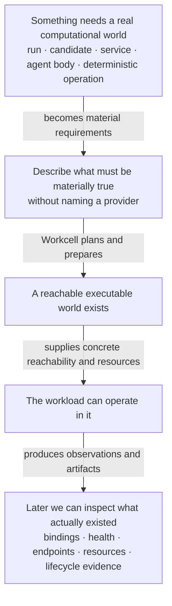
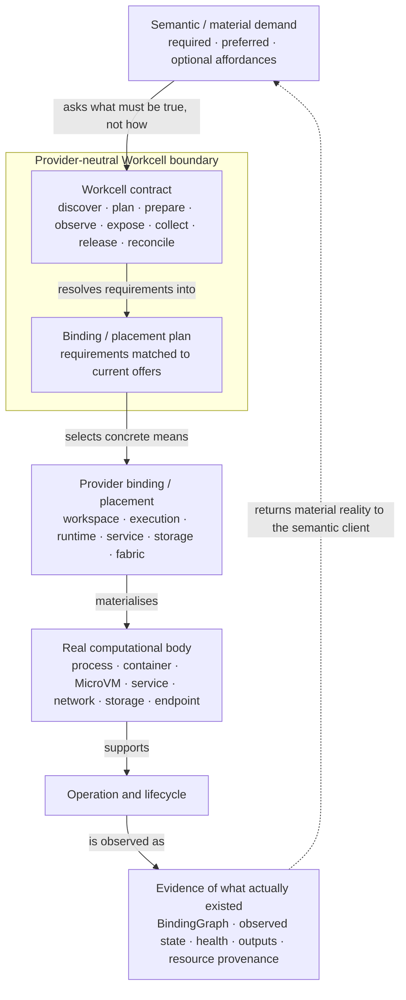
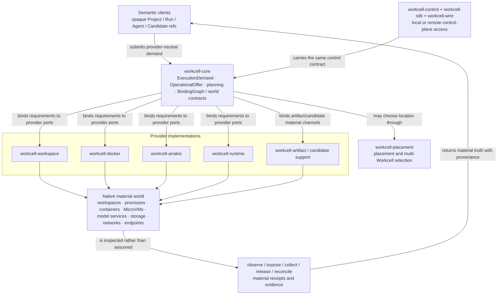

# Workcell Visual Product Understanding

**Status:** canonical product-understanding surface  
**Architecture status:** accepted `main`, including provider-neutral core, Docker/Arrakis/runtime providers, placement/control/SDK seams, model-serving conformance and material authority/secret boundaries  
**Sources:** `ARCHITECTURE.md`, `CANDIDATE-MATERIALISATION.md`, `LIFECYCLE-RECONCILIATION.md`, provider integration docs, current Rust crates, and accepted conformance fixtures.

Workcell exists at the point where semantic demand must stop being merely a description and become an inspectable computational body. Its abstraction is valuable only if that boundary remains visible.

## 1. Experience — a demanded capability becomes an actual world you can inspect

The user or higher-level agent reasons in terms of the world required, not Docker bridge names, VM IDs, fixed host paths or provider brands. Those details remain available as provenance after materialisation.

## 2. Product / conceptual relation — abstraction crosses into material actuality

The horizontal cut is the point: **semantic identity stays above; bindings and physical identities live below**. A Candidate, Agent, Run or Harness may use a Workcell world without being redefined as that container, VM, process, endpoint or host.

## 3. Architecture — current Rust materialisation stack

Provider-specific IDs, paths, ports, engine flags and lease/material-secret details are binding/provenance facts. The current containment and secret-materialisation work strengthens the **physical authority boundary**; it does not move semantic Action/Agency/Project authority into Workcell.

## 4. Diagram audit

| Existing visual | Class | Disposition |
|---|---|---|
| `ARCHITECTURE.md` semantic client → ExecutionDemand → core → provider ports → BindingGraph → physical resources | architecture | **Preserve but supersede as the only first visual.** It is accurate; the new experience and conceptual diagrams explain why that stack exists and make the abstraction/material cut clearer. |
| collapsed-local vs remote Control Service ASCII | specialist architecture | **Preserve.** It explains transport topology without redefining the Workcell contract. |
| connectivity/fabric diagrams | specialist architecture | **Preserve.** They explain logical reachability and provider realisation. |
| Candidate materialisation diagrams | cross-product specialist | **Preserve.** Candidate remains Factory-owned while Workcell supplies the body. |
| deployment-profile and multi-Workcell maps | operational architecture | **Preserve.** They answer placement questions after the provider-neutral relation is understood. |
| provider-specific Docker/Arrakis/model-serving diagrams and fixtures | implementation/evidence | **Preserve.** They are conformance specimens, not the ontology. |

## 5. Verification

**Semantic:** the conceptual diagram makes the abstraction/material boundary spatially explicit. The arrows distinguish requirement, resolution, binding, materialisation, operation, observation and return.

**Implementation:** the architecture uses crate and operation seams present on accepted `main`. It does not claim a cluster framework, universal daemon, specific fabric brand or one mandatory isolation technology.

**Cross-product:** Workcell is not AIKit: AIKit resolves what operative world/body should be available, while Workcell materialises material requirements. Workcell is not a generic executor: the durable product is the provider-neutral relation plus inspectable bindings/lifecycle evidence, not simply “run command”.

## 6. Public-site projection

Project the **abstraction crossing into a real body** diagram for the public/design surface. A deeper technical page can reinterpret the Rust provider architecture. Do not lead with Docker, Arrakis, ports or deployment profiles; those are proof that the contract survives heterogeneous bodies, not the human reason for the product.